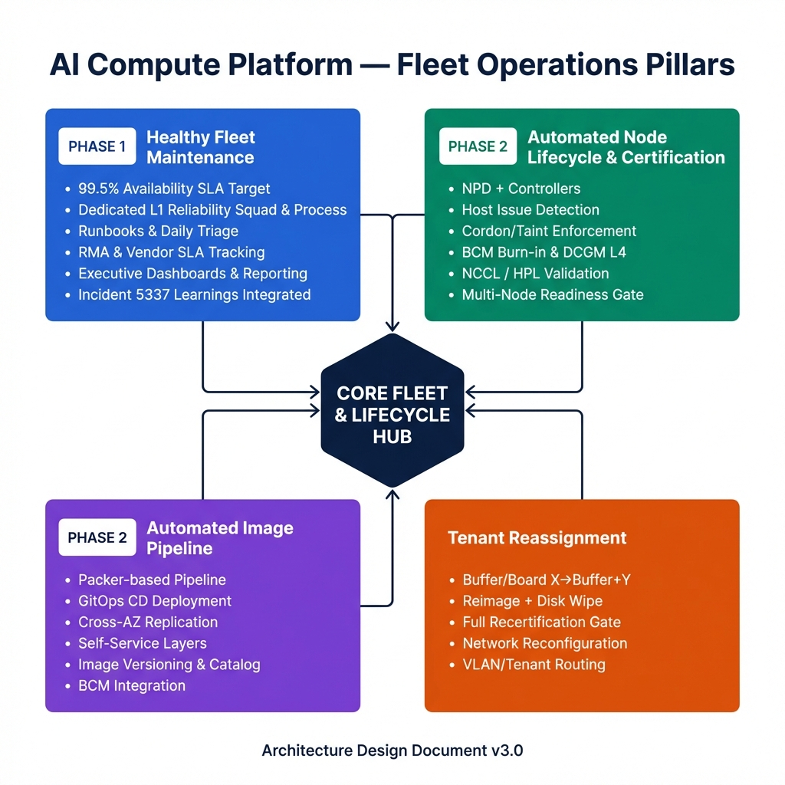
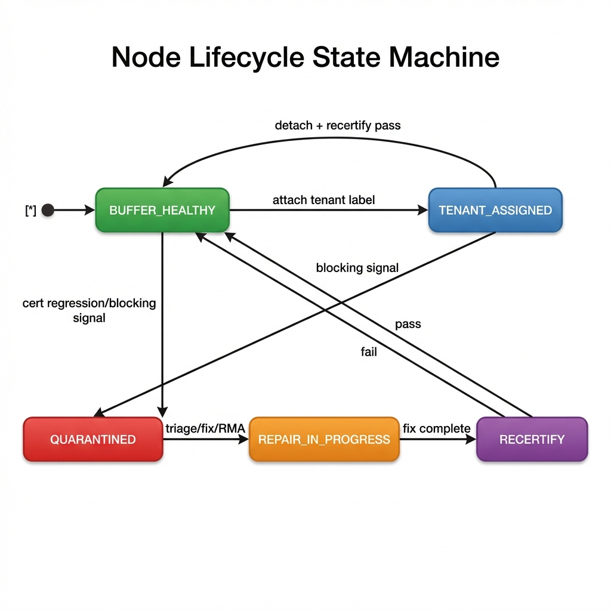
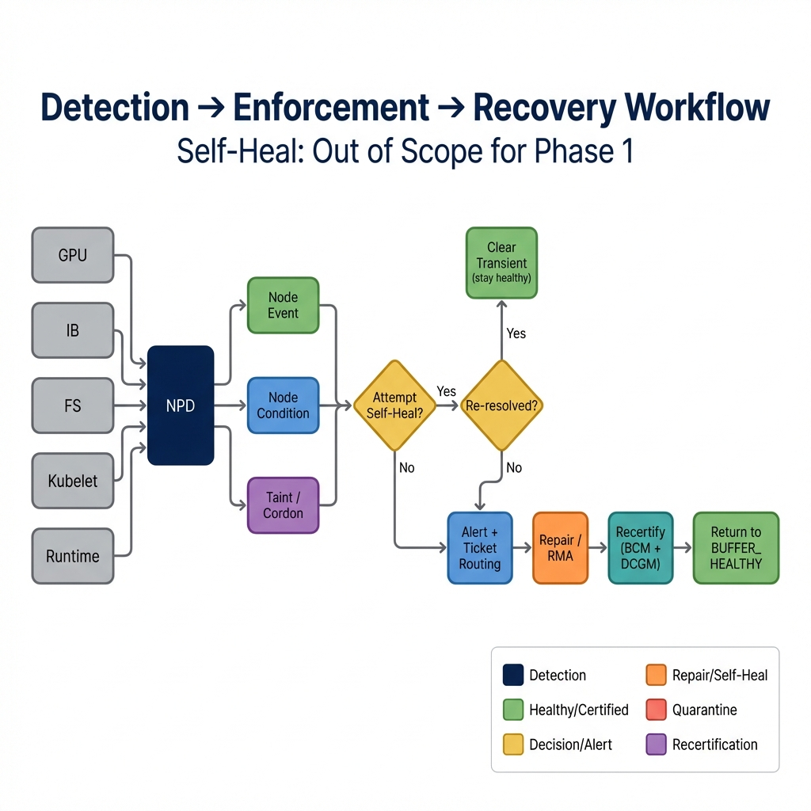
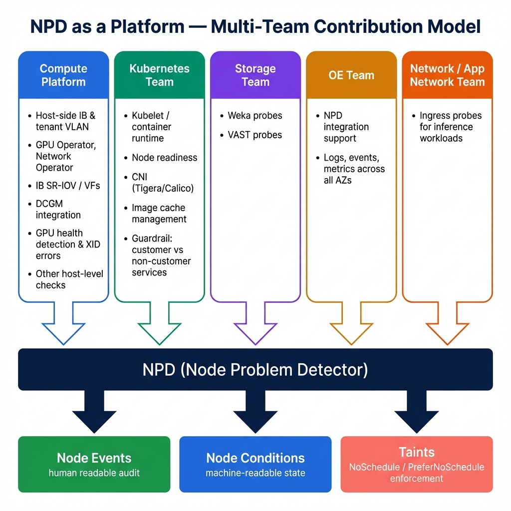
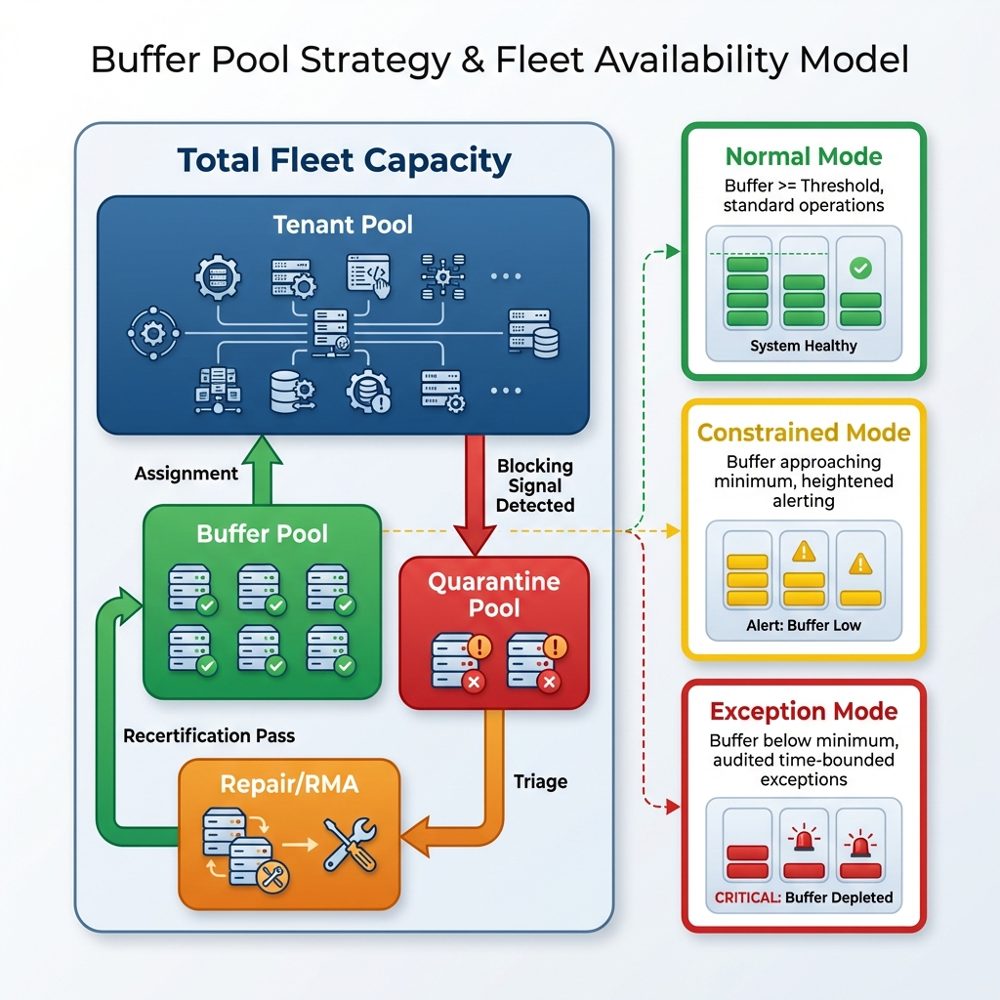

# Healthy Fleet Maintenance & Tenant-Safe Node Lifecycle

## Architecture Design Document

This repository contains the **Architecture Design Document** for the Healthy Fleet Maintenance & Tenant-Safe Node Lifecycle platform feature.

### Document

📄 **[Healthy_Fleet_Maintenance_Architecture_Design.docx](./Healthy_Fleet_Maintenance_Architecture_Design.docx)**

### Overview

The document defines a deterministic, automated state transition model for GPU compute nodes, ensuring:

1. **Tenant Safety by Default** — No scheduling on degraded or uncertified nodes
2. **99.5% Fleet Availability** — Buffer pool model with rapid remediation
3. **Node Certification Pipeline** — BCM burn-in + DCGM/DCGMI diagnostics
4. **Deterministic Tenant Reassignment** — Secure lifecycle transitions

### Architecture Diagrams

| Diagram | Description |
|---------|-------------|
|  | Four-Pillar Problem Space Overview |
|  | Node Lifecycle State Machine |
|  | Detection → Enforcement → Recovery Workflow |
|  | NPD Multi-Team Contribution Model |
|  | Buffer Pool Strategy & Availability Model |

### Document Contents

- Executive Summary
- Feature Description
- Goals & Objectives
- Scope Definition (In/Out Scope)
- Architecture Design (Layered View, NPD Platform, Good Host Definition, State Machine, Workflows)
- Infrastructure Callouts (L1 Squad, Tooling, Incident 5337 Integration)
- End-to-End Test Plan
- Enterprise Promises
- Deployment, Observability & Ongoing Operations
- Customer Impact
- Appendices (Diagrams Index, Glossary)

### Generation

The Word document is programmatically generated using `python-docx`:

```bash
python3 generate_arch_doc.py
```

### Author

Distinguished Engineer, AI Compute Platform
